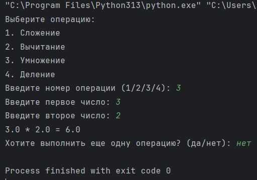

# Исполнитель
Жолкевская Дарья Фт-320007

# Краткое описание
Этот код реализует простой текстовый калькулятор на Python. Он позволяет пользователю выбрать одну из четырех арифметических операций (сложение, вычитание, умножение, деление), ввести два числа и получить результат выбранной операции. Пользователь может продолжать выполнять операции до тех пор, пока не решит остановиться.

# Среда программирования, язык
PyCharm Community Edition 2024.1.1 ; Python 3.13

# Тест

